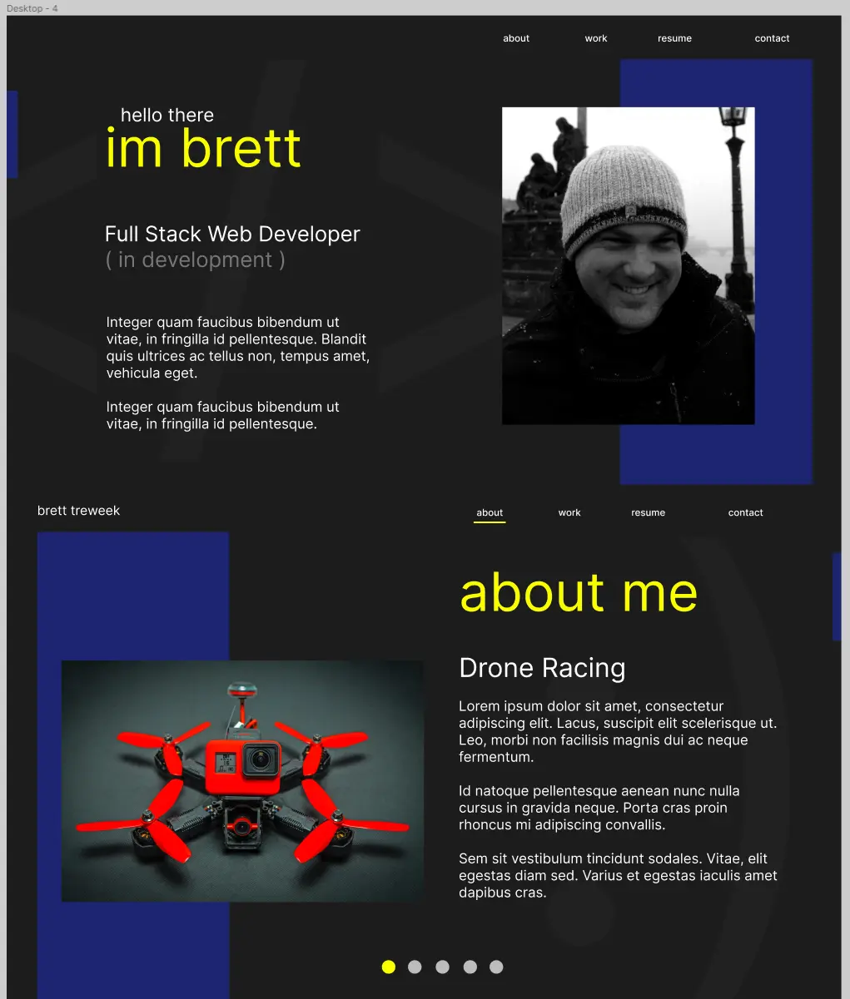
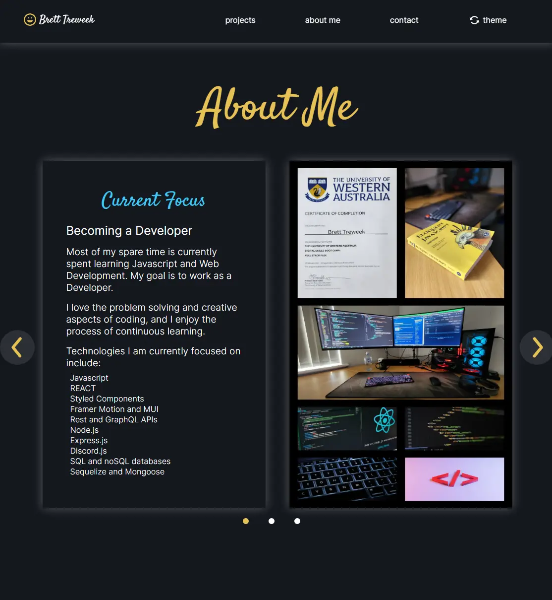

# My Portfolio

## Description
[Here is a link to the deployed site](https://www.btreweek.com/)

I designed, built and deployed this portfolio website to hopefully help me get a job as a develloper. I will be sending a link to this portfolio in all of my job applications. Wish me luck :)

---

Figma Design

---

Final Product

---

## Technologies Used

### Figma

- Used to design and prototype.
- Was very useful in quickly getting icons with iconify plugin and creating svg files.

### Styled Components
- A Styling library for React.
- Styled components is supposed to result in cleaner, component scoped css. I think I made a mess of styled components in this project as I ended up using classNames all over the place, and a confusing file structure.

### Material UI
- A library of ready to go components for React which was great to use.
- Helped with quick snackbar when sending contact form.

## Framer Motion
- Animation library which I tried out. Pretty useful but once again I made a mess by using framer motion for some animations and css for others.

### Email.js
- A third party service which allows for the sending of emails through forms by using js on the front-end, so no need for a backend to handle the contact form. This was great as it simplified this project.

### Hostinger
- A web hosting provider used to cheaply purchase web hosting and domain name.

### React
- Front-end framework.
- This project was great for me to practice using react and reinforce some of the fundamentals of js and react.
- The about carousel is custom, hence its clunkiness and non-swipeability on mobile.

